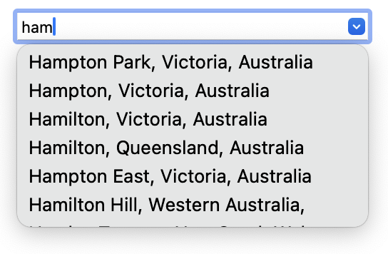

# vueAutocompleteCity

Vue component that autocompletes city names as the user types ahead.



This is essentially a Vue packaging of my project [autocompleteCity](https://github.com/kode95/autocompleteCity). **Please skim the readme of that project to see if this kind of autocomplete input is right for your project.**

## Installation and usage

### Normal Vue app

1. Move AutocompleteCity.vue into src/components.
1. Move autocompleteCityNames.js into src/assets.
1. In a view, use the component like this:
```html
<template>
  <AutocompleteCity @select-city="selectCity" city-name="Default city name" />
</template>

<script setup>
import AutocompleteCity from '@/components/AutocompleteCity.vue'

function selectCity(city) {
  console.log(city)
}
</script>
```

### Nuxt

1. In the root directory of your Nuxt installation, create the directories *assets* and *components* if they don't exist already.
1. Move AutocompleteCity.vue into components.
1. Move autocompleteCityNames.js into assets.
1. In a view, use the component like this:
```html
<template>
  <AutocompleteCity @select-city="selectCity" city-name="Default city name" />
</template>

<script setup>
// No import needed; Nuxt auto-imports it.

function selectCity(city) {
  console.log(city)
}
</script>
```